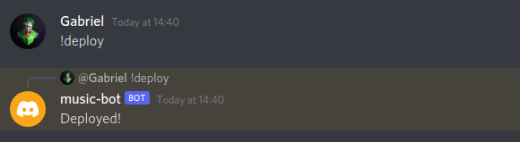
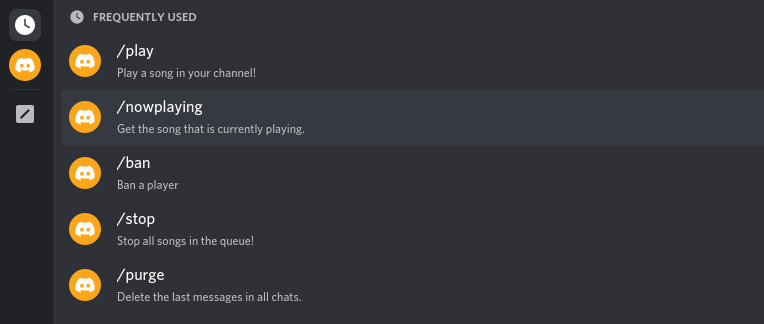
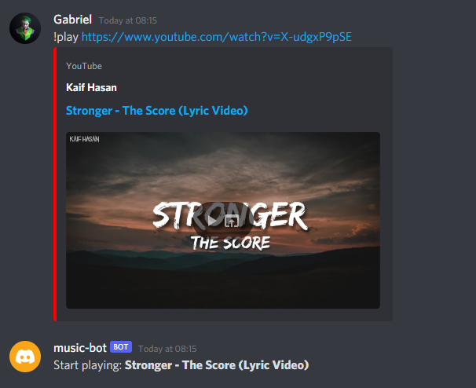

# Discord Music bot

A simple discord bot that helps you manage your server by providing useful commands like playing music or deleting text messages.

You can find the tutorial about building a discord music bot [here](https://gabrieltanner.org/blog/dicord-music-bot).

## Table of content

* [Requirements](#requirements)
* [Getting started](#getting-started)
* [Docker](#docker)
* [Features & Commands](#features--commands)
* [Common errors](#common-errors)
* [Contributing](#contributing)
* [Author](#author)
* [License](#license)

## Requirements

- [Node](https://nodejs.org/en/) - Version 16 or higher
- [NPM](https://www.npmjs.com/)
- [FFMPEG](https://www.ffmpeg.org/)
- [Docker](https://www.docker.com/) (optional)

## Getting started

First, make sure you have all the required tools installed on your local machine then continue with these steps.

### Installation

```bash
# Clone the repository
git clone https://github.com/TannerGabriel/discord-bot.git

# Enter into the directory
cd discord-bot/

# Install the dependencies
npm install

# Configure Discord Bot Token
 echo "DISCORD_TOKEN='INSERT_YOUR_TOKEN_HERE'" > .env
```

### Other environment variables

Currently we also need to set the `DP_FORCE_YTDL_MOD` environment variable to override `ytdl-core` for the `discord-player`.

```
DISCORD_TOKEN=INSERT_YOUR_TOKEN_HERE
DP_FORCE_YTDL_MOD="@distube/ytdl-core"
```

### Required permissions

Make sure that your bot has the `applications.commands` application scope enabled, which can be found under the `OAuth2` tab on the [developer portal](https://discord.com/developers/applications/)

Enable the `Server Members Intent` and `Message Content Intent` which can be found under the `Bot` tab on the [developer portal](https://discord.com/developers/applications/)

### Configuration

After cloning the project and installing all dependencies, you need to add your Discord API token in the `.env` file.

### Changing the status

You can change the status of your discord bot by editing the `activity` and `activityType` variables inside the `config.json` file. `activityType` needs to be set to an integer with the following [options](https://discord-api-types.dev/api/discord-api-types-v10/enum/ActivityType).


### Starting the application

```bash
node index.js
```

### Starting the application using Docker

```bash
# Build the image
docker build --tag discordbot .

# Run the image
docker run -d discordbot
```

### Deploying commands

Before you can use the bots slash command you first need to add them to your Discord server. You can use the `!deploy` command to do so.



After deploying the commands you should be able to see and access them by typing a slash:



## Docker

A mutliarch docker image for `amd64` and `arm64` based on the main branch is available from Github Container Registry:

```bash
docker pull ghcr.io/TannerGabriel/discord-bot:latest
```

A Github Action automatically builds and push `amd64` and `arm64` to ghcr.io, all builds are based on the main branch.

Only `:latest` tag is supported, otherwise use SHA256 from https://github.com/TannerGabriel/discord-bot/pkgs/container/discord-bot for pinning to a specific commit.

## Features & Commands

> Note: The repository now uses the new Discord slash commands

* [Play](#play)
* [Pause](#pause)
* [Resume](#resume)
* [Now Playing](#now-playing)
* [Queue](#queue)
* [Shuffle](#shuffle)
* [Loop](#loop)
* [Skip](#skip)
* [Remove](#remove)
* [Move](#move)
* [Swap](#swap)
* [Stop](#stop)
* [Volume](#volume)
* [Help](#help)
* [Userinfo](#userinfo)
* [Ban](#ban)
* [Purge](#purge)

### Play

▶️ Play music from YouTube via url or search by song name, added to the bottom of the queue.

`/play YOUTUBE_URL`  
`/play SONG_NAME`

▶️ Play music via url or using song name, this places it next at the top of the queue (position 1).

`/playtop YOUTUBE_URL`  
`/playtop SONG_NAME`



### Pause

⏸️ Pause music

`/pause`

### Resume

▶️ Resume playing paused music

`/resume`

### Now Playing

🎶 Display current playing song

`/nowplaying`

### Queue

🗒️ Display the current queue

`/queue`

### Shuffle

🔀 Shuffle the current queue

`/shuffle`

### Loop

🔁 Loop/Repeat controls. Off, Track and Queue

`/loop MODE`

### Skip

⏭️ Skip the current playing song and play the next in queue

`/skip`

### Remove

⏏ Remove song from the queue

`/remove POSITION`

### Move

↕ Move song position. This shifts all other songs up or down one, depending on direction you move the target song.

`/move TRACK_POSITION TARGET_POSITION`

### Swap

↔️ Swap two songs current positions with each other

`/swap POSITION_1 POSITION_2`

### Stop

🔇 Stop playing (disconnects bot from voice channel)

`/stop`

### Volume

🔊 Adjust the music bot volume between 0-200

`/volume NUMBER`

### Help

❓ Display commands

`/help`

### Userinfo

* Get information about a user (/userinfo USER)

### Ban

* Ban a player (/ban USER)

### Purge

* Delete the latest chat messages (/purge NUM_OF_MESSAGES)

## Common errors

Here is a list of common errors and how you can fix them.

### Dependencies aren't up to date

The packages used in this repository get updated often, especially the ytdl-core package. That is why it is always worth a try updating those if you get an error like `invalid URL: undefined` or when the bot crashes when running the play command.

```bash
npm install ytdl-core@latest
```

### FFMPEG is not installed on the machine running the bot

The `play` command requires FFMPEG to be installed on the machine that is running the bot. You can download it on the official [FFMPEG website](https://www.ffmpeg.org/). Note: This isn't relevant if you use the Dockerfile because it will install FFMPEG inside of the container.

## Contributing

You are welcome to contribute by submitting a Pull Request to the repository.

## Author

[Gabriel Tanner](https://gabrieltanner.org/)

## Support me

<a href="https://www.buymeacoffee.com/gabrieltanner" target="_blank"></a>

## License

This project is licensed under the MIT License - see the [LICENSE.md](LICENSE) file for details
